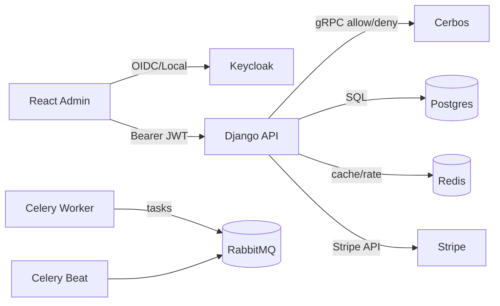
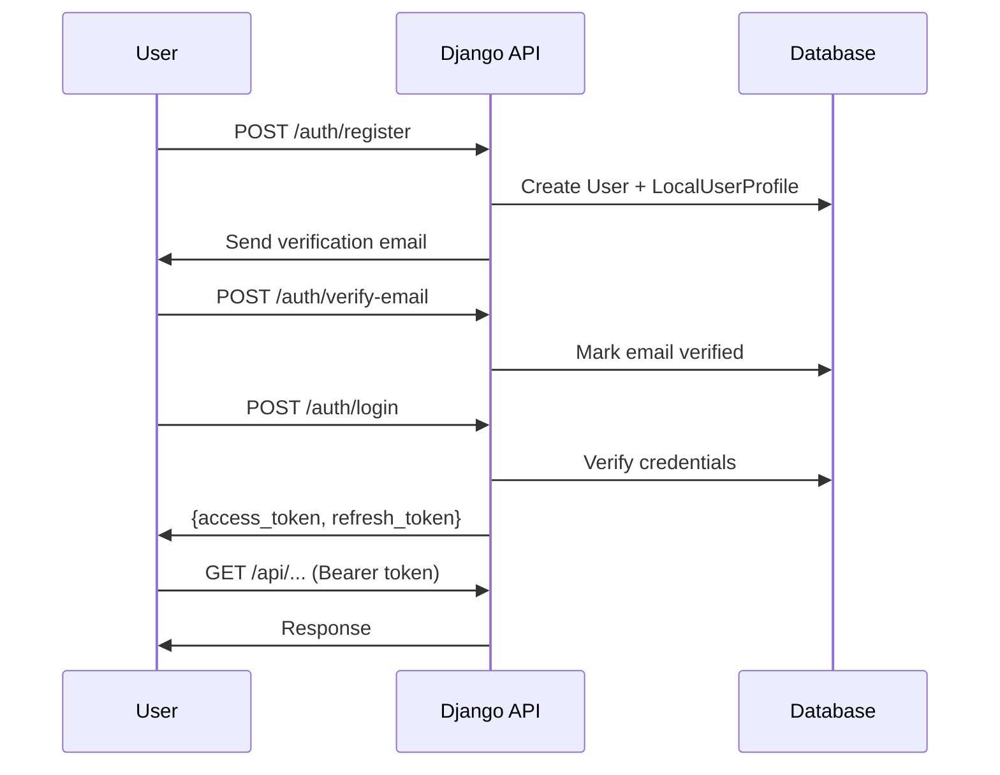
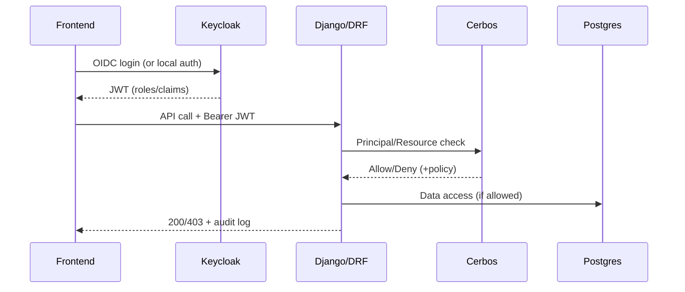

# Django + DRF + Keycloak + Cerbos Boilerplate (High-Scale RBAC/ABAC)

Production-ready, multi-tenant SaaS boilerplate with enterprise security features. Includes RBAC/ABAC authorization (Cerbos), hybrid authentication (Keycloak + Local), Stripe billing (B2B & B2C), React admin console, and comprehensive audit logging.

## Table of Contents

- [Features](#features)
- [Service Topology](#service-topology)
- [Quickstart](#quickstart)
- [Environment Variables](#environment-variables)
- [Secrets Handling](#secrets-handling)
- [API Reference](#api-reference)
- [Authentication](#authentication)
- [Authentication Audiences](#authentication-audiences)
- [Stripe Billing](#stripe-billing)
- [Frontend Admin Console](#frontend-admin-console)
- [Audit Trail](#audit-trail)
- [Account Lockout Notifications](#account-lockout-notifications)
- [Custom Webhooks](#custom-webhooks)
- [Storage Configuration](#storage-configuration)
- [Runbooks](#runbooks)
- [Architecture Overview](#architecture-overview)
- [Testing](#testing)

## Features

### Security & Authentication
- **Hybrid Auth**: Keycloak OIDC + Local JWT (RS256) authentication
- **RBAC/ABAC**: Cerbos policy decision point with Redis-cached decisions
- **Argon2 Passwords**: Industry-standard password hashing
- **MFA Support**: Multi-factor authentication via Keycloak
- **Account Lockout**: Brute-force protection with django-axes
- **Lockout Notifications**: Email alerts to users and admins on account lockouts
- **Mass Attack Detection**: Automated admin alerts for credential stuffing attempts
- **Rate Limiting**: Global and per-tenant throttling with tier-based quotas

### Multi-Tenancy
- **Organizations**: Multi-org data isolation
- **Teams**: Org-scoped team management
- **Memberships**: Flexible role assignments (org_roles, team_roles)
- **License Tiers**: Per-org feature gating (free, starter, pro, enterprise)

### Billing (Stripe)
- **B2B Org Billing**: Organization-level subscriptions
- **B2C User Billing**: Individual user subscriptions
- **Webhook Handling**: Automatic tier updates on subscription events
- **Billing Portal**: Self-service subscription management

### Admin Console (React)
- **Organizations Management**: CRUD with license management
- **Teams Management**: Create/edit teams with member management
- **Users Management**: Invite, create, deactivate users
- **Audit Log Viewer**: Search, filter, export audit logs
- **System Monitoring**: Celery health, queue stats, metrics

### Observability
- **Structured Logging**: JSON logs with structlog
- **Audit Trail**: Tamper-evident logs with hash chain verification
- **Prometheus Metrics**: `/api/v1/monitoring/metrics`
- **Sentry Integration**: Error tracking and tracing
- **Health Probes**: Kubernetes-ready liveness/readiness

## Service Topology

Development stack via Docker Compose:

| Service | Description | Port |
|---------|-------------|------|
| web | Django/DRF API (stateless) | 8000 |
| frontend | React Admin Console (Vite) | 5173 |
| celery | Celery workers (async tasks) | - |
| celery-beat | Celery scheduler | - |
| cerbos | Policy Decision Point (RBAC/ABAC) | 3592, 3593 |
| keycloak | Identity Provider (OIDC) | 8080 |
| postgres | Primary database | 5432 |
| rabbitmq | Celery broker (durable queues + DLQ) | 5672, 15672 |
| redis | Cache, rate limits, locks | 6379 |
| mailpit | Email testing (dev only) | 8025, 1025 |
| stripe-mock | Stripe API mock (dev only) | 12111 |



## Quickstart

### Prerequisites

- Python 3.13+
- Node.js 20+ (for frontend)
- Docker and Docker Compose
- `uv` (recommended) or `pip`

### 1. Clone and Setup

```bash
git clone <repo-url>
cd django-boilerplate

# Backend: Create virtual environment
python -m venv .venv
source .venv/bin/activate
pip install -r requirements.txt -r requirements-dev.txt

# Frontend: Install dependencies
cd frontend && pnpm install && cd ..
```

### 2. Configure Environment

```bash
cp .env.example .env
# Edit .env with your values (defaults work for local dev)
```

### 3. Start Services

```bash
# Start all services
docker compose -f compose/docker-compose.yml up -d

# Wait for services to be healthy (~30s for Keycloak)
docker compose -f compose/docker-compose.yml ps

# Run database migrations
docker compose -f compose/docker-compose.yml exec -w /app/backend web python manage.py migrate
```

### 4. Seed Data (Development)

Add test data to your database:

```bash
# Seed Django database with test org, team, users
docker compose -f compose/docker-compose.yml exec -w /app/backend web python manage.py shell < test-seed/seed.py

# Seed Keycloak with test users (run from host with venv activated)
python test-seed/keycloak_seed.py
```

### 5. Verify Setup

Confirm all services are working:

```bash
# Check all services are healthy
docker compose -f compose/docker-compose.yml ps

# Get a test token (outputs tokens for all test users)
python test-seed/keycloak_tokens.py

# Test an API call
TOKEN="<paste access token from above>"
curl -H "Authorization: Bearer $TOKEN" http://localhost:8000/api/v1/auth/me
```

### 7. Access Services

| Service | URL | Credentials |
|---------|-----|-------------|
| API | http://localhost:8000 | - |
| Admin Console | http://localhost:5173 | See below |
| Keycloak Admin | http://localhost:8080 | admin / admin |
| RabbitMQ | http://localhost:15672 | guest / guest |
| Mailpit | http://localhost:8025 | - |

### 8. Create Admin User (Local Auth)

```bash
# Register via API
curl -X POST http://localhost:8000/api/v1/auth/register \
  -H "Content-Type: application/json" \
  -d '{"email": "admin@example.com", "password": "SecurePass123!", "first_name": "Admin", "last_name": "User"}'

# Or use Django management command
docker compose -f compose/docker-compose.yml exec -w /app/backend web \
  python manage.py createsuperuser
```

## Environment Variables

### Core Django

| Variable | Description | Default |
|----------|-------------|---------|
| `DJANGO_SECRET_KEY` | Secret key (change in production!) | `changeme` |
| `DJANGO_DEBUG` | Enable debug mode | `true` |
| `DJANGO_ALLOWED_HOSTS` | Comma-separated allowed hosts | `localhost,127.0.0.1` |
| `DJANGO_SETTINGS_MODULE` | Settings module | `config.settings.local` |
| `FRONTEND_URL` | Frontend URL for redirects | `http://localhost:5173` |

### Database (PostgreSQL)

| Variable | Description | Default |
|----------|-------------|---------|
| `POSTGRES_DB` | Database name | `app` |
| `POSTGRES_USER` | Database user | `app` |
| `POSTGRES_PASSWORD` | Database password | `changeme` |
| `POSTGRES_HOST` | Database host | `postgres` |
| `POSTGRES_PORT` | Database port | `5432` |

### Redis & RabbitMQ

| Variable | Description | Default |
|----------|-------------|---------|
| `REDIS_HOST` | Redis host | `redis` |
| `REDIS_PORT` | Redis port | `6379` |
| `RABBITMQ_HOST` | RabbitMQ host | `rabbitmq` |
| `RABBITMQ_USER` | RabbitMQ user | `guest` |
| `RABBITMQ_PASSWORD` | RabbitMQ password | `guest` |

### Authentication (Keycloak)

| Variable | Description | Default |
|----------|-------------|---------|
| `KEYCLOAK_SERVER_URL` | Keycloak server URL | `http://keycloak:8080` |
| `KEYCLOAK_REALM` | Keycloak realm | `app` |
| `KEYCLOAK_CLIENT_ID` | Keycloak client ID | `api` |
| `KEYCLOAK_AUDIENCE` | Expected JWT audience | `api` |

### Local Authentication

| Variable | Description | Default |
|----------|-------------|---------|
| `LOCAL_AUTH_ENABLED` | Enable local auth | `true` |
| `LOCAL_AUTH_ACCESS_TOKEN_TTL` | Access token TTL (seconds) | `900` |
| `LOCAL_AUTH_REFRESH_TOKEN_TTL` | Refresh token TTL (seconds) | `604800` |
| `LOCAL_AUTH_MAX_FAILED_ATTEMPTS` | Max failed logins before lockout | `5` |
| `LOCAL_AUTH_LOCKOUT_DURATION` | Lockout duration (seconds) | `1800` |
| `EMAIL_VERIFICATION_REQUIRED` | Require email verification | `true` |

### Authorization (Cerbos)

| Variable | Description | Default |
|----------|-------------|---------|
| `CERBOS_URL` | Cerbos server URL | `http://cerbos:3592` |
| `CERBOS_DECISION_CACHE_TTL` | Decision cache TTL (seconds) | `30` |

### Stripe Billing

| Variable | Description | Default |
|----------|-------------|---------|
| `STRIPE_ENABLED` | Enable Stripe integration | `false` |
| `STRIPE_SECRET_KEY` | Stripe secret key | `` |
| `STRIPE_PUBLISHABLE_KEY` | Stripe publishable key | `` |
| `STRIPE_WEBHOOK_SECRET` | Stripe webhook signing secret | `` |
| `STRIPE_PRICE_STARTER` | Price ID for starter tier | `price_starter` |
| `STRIPE_PRICE_PRO` | Price ID for pro tier | `price_pro` |
| `STRIPE_PRICE_ENTERPRISE` | Price ID for enterprise tier | `price_enterprise` |

### Email

| Variable | Description | Default |
|----------|-------------|---------|
| `EMAIL_BACKEND` | Django email backend | `console` |
| `EMAIL_HOST` | SMTP host | `mailpit` |
| `EMAIL_PORT` | SMTP port | `1025` |
| `EMAIL_USE_TLS` | Use TLS | `false` |
| `DEFAULT_FROM_EMAIL` | Default sender email | `noreply@example.com` |

### Security

| Variable | Description | Default |
|----------|-------------|---------|
| `ADMIN_HOSTNAME` | Hostname for Django admin (production) | `` |
| `AXES_FAILURE_LIMIT` | Login failures before lockout | `5` |
| `AXES_COOLOFF_TIME` | Lockout duration (hours) | `1` |
| `LOCKOUT_NOTIFICATION_ENABLED` | Send email on account lockout | `true` |
| `LOCKOUT_ADMIN_EMAILS` | Admin emails for mass lockout alerts (comma-separated) | `` |
| `LOCKOUT_MASS_THRESHOLD` | Lockout count to trigger admin alert | `10` |
| `LOCKOUT_MASS_WINDOW_MINUTES` | Time window for mass lockout detection (minutes) | `5` |
| `THROTTLE_RATE_ANON` | Anonymous rate limit | `100/hour` |
| `THROTTLE_RATE_USER` | Authenticated rate limit | `1000/hour` |
| `CORS_ALLOWED_ORIGINS` | Allowed CORS origins | `http://localhost:5173` |

### Observability

| Variable | Description | Default |
|----------|-------------|---------|
| `LOG_LEVEL` | Logging level | `INFO` |
| `ENVIRONMENT` | Environment name | `development` |
| `AUDIT_PII_POLICY` | PII handling: mask, hash, drop | `mask` |
| `SENTRY_DSN` | Sentry DSN (empty to disable) | `` |

## Secrets Handling

### Development
In development, use the `.env` file with demo credentials. The included values are safe for local testing.

### Production
Never commit real secrets. Use a secret manager:

| Secret Manager | Setup |
|----------------|-------|
| AWS Secrets Manager | Store as JSON, load via boto3 |
| HashiCorp Vault | Use hvac library |
| GCP Secret Manager | Use google-cloud-secret-manager |
| Azure Key Vault | Use azure-keyvault-secrets |

### Secrets Inventory

These variables contain sensitive data and MUST be secured in production:

| Variable | Type | Generation |
|----------|------|------------|
| `DJANGO_SECRET_KEY` | String | `python -c "from django.core.management.utils import get_random_secret_key; print(get_random_secret_key())"` |
| `POSTGRES_PASSWORD` | String | Strong random password |
| `RABBITMQ_PASSWORD` | String | Strong random password |
| `LOCAL_AUTH_PRIVATE_KEY` | RSA PEM | `python -c "from api.local_jwt import generate_key_pair; priv, pub = generate_key_pair(); print(priv)"` |
| `LOCAL_AUTH_PUBLIC_KEY` | RSA PEM | Generated with private key |
| `STRIPE_SECRET_KEY` | String | From Stripe dashboard |
| `STRIPE_WEBHOOK_SECRET` | String | From Stripe webhook settings |
| `AUDIT_SIGNING_KEY` | Hex | `python -c "import secrets; print(secrets.token_hex(32))"` |
| `FIELD_ENCRYPTION_KEYS` | Fernet | `python -c "from cryptography.fernet import Fernet; print(Fernet.generate_key().decode())"` |

### Key Rotation
See [Runbooks](#runbooks) for key rotation procedures.

## API Reference

### Health & Monitoring

| Endpoint | Method | Auth | Description |
|----------|--------|------|-------------|
| `/healthz` | GET | No | Basic health check |
| `/api/v1/health/live` | GET | No | Kubernetes liveness probe |
| `/api/v1/health/ready` | GET | No | Kubernetes readiness probe |
| `/api/v1/monitoring/overview` | GET | Admin | System overview |
| `/api/v1/monitoring/server` | GET | Admin | Server metrics |
| `/api/v1/monitoring/metrics` | GET | No | Prometheus metrics |
| `/api/v1/monitoring/metrics/json` | GET | No | JSON metrics |
| `/api/v1/monitoring/celery/health` | GET | No | Celery worker health |
| `/api/v1/monitoring/celery/stats` | GET | No | Celery statistics |
| `/api/v1/monitoring/queues` | GET | No | RabbitMQ queue stats |
| `/api/v1/monitoring/tasks` | GET | No | Registered Celery tasks |

### Local Authentication

| Endpoint | Method | Auth | Description |
|----------|--------|------|-------------|
| `/api/v1/auth/register` | POST | No | Register new user |
| `/api/v1/auth/login` | POST | No | Login (returns JWT tokens) |
| `/api/v1/auth/logout` | POST | JWT | Logout (revoke refresh token) |
| `/api/v1/auth/refresh` | POST | No | Refresh access token |
| `/api/v1/auth/me` | GET | JWT | Get current user profile |
| `/api/v1/auth/verify-email` | POST | No | Verify email with token |
| `/api/v1/auth/resend-verification` | POST | No | Resend verification email |
| `/api/v1/auth/forgot-password` | POST | No | Request password reset |
| `/api/v1/auth/reset-password` | POST | No | Reset password with token |
| `/api/v1/auth/change-password` | POST | JWT | Change password (authenticated) |

### Keycloak Authentication

| Endpoint | Method | Auth | Description |
|----------|--------|------|-------------|
| `/api/v1/ping` | GET | JWT | Auth verification endpoint |
| `/api/v1/protected` | GET | JWT | Sample protected endpoint |

### B2B Organization Billing

| Endpoint | Method | Auth | Description |
|----------|--------|------|-------------|
| `/api/v1/orgs/{id}/billing` | GET | Org Admin | Get org billing status |
| `/api/v1/orgs/{id}/billing/checkout` | POST | Org Admin | Create Stripe checkout session |
| `/api/v1/orgs/{id}/billing/portal` | POST | Org Admin | Create billing portal session |
| `/api/v1/orgs/{id}/billing/customer` | POST | Org Admin | Create Stripe customer |
| `/api/v1/billing/plans` | GET | JWT | List available subscription plans |

### B2C User Billing

| Endpoint | Method | Auth | Description |
|----------|--------|------|-------------|
| `/api/v1/me/billing` | GET | JWT | Get user billing status |
| `/api/v1/me/billing/checkout` | POST | JWT | Create checkout session |
| `/api/v1/me/billing/portal` | POST | JWT | Create billing portal session |
| `/api/v1/me/billing/customer` | POST | JWT | Create Stripe customer |

### Organization Licensing

| Endpoint | Method | Auth | Description |
|----------|--------|------|-------------|
| `/api/v1/orgs/{id}/license` | GET | Org Admin | Get org license info |
| `/api/v1/orgs/{id}/license` | PUT | Org Admin | Update org license |
| `/api/v1/stripe/webhook` | POST | Stripe Sig | Stripe webhook handler |

### Platform Admin - Organizations

| Endpoint | Method | Auth | Description |
|----------|--------|------|-------------|
| `/api/v1/admin/orgs` | GET | Platform Admin | List all organizations |
| `/api/v1/admin/orgs` | POST | Platform Admin | Create organization |
| `/api/v1/admin/orgs/{id}` | GET | Platform Admin | Get organization details |
| `/api/v1/admin/orgs/{id}` | PUT | Platform Admin | Update organization |
| `/api/v1/admin/orgs/{id}` | DELETE | Platform Admin | Soft-delete organization |

### Platform Admin - Teams

| Endpoint | Method | Auth | Description |
|----------|--------|------|-------------|
| `/api/v1/admin/teams` | GET | Platform Admin | List all teams |
| `/api/v1/admin/teams` | POST | Platform Admin | Create team |
| `/api/v1/admin/teams/{id}` | GET | Platform Admin | Get team details |
| `/api/v1/admin/teams/{id}` | PUT | Platform Admin | Update team |
| `/api/v1/admin/teams/{id}` | DELETE | Platform Admin | Delete team |
| `/api/v1/admin/teams/{id}/members` | GET | Platform Admin | List team members |
| `/api/v1/admin/teams/{id}/members` | POST | Platform Admin | Add team member |

### Platform Admin - Users

| Endpoint | Method | Auth | Description |
|----------|--------|------|-------------|
| `/api/v1/admin/users` | GET | Platform Admin | List all users |
| `/api/v1/admin/users` | POST | Platform Admin | Create user |
| `/api/v1/admin/users/invite` | POST | Platform Admin | Invite user via email |
| `/api/v1/admin/users/{id}` | GET | Platform Admin | Get user details |
| `/api/v1/admin/users/{id}` | PUT | Platform Admin | Update user |
| `/api/v1/admin/users/{id}` | DELETE | Platform Admin | Deactivate user |
| `/api/v1/admin/users/{id}/memberships` | GET | Platform Admin | List user memberships |
| `/api/v1/admin/users/{id}/memberships` | POST | Platform Admin | Add membership |
| `/api/v1/admin/users/{id}/resend-invite` | POST | Platform Admin | Resend invite email |

### Platform Admin - Memberships

| Endpoint | Method | Auth | Description |
|----------|--------|------|-------------|
| `/api/v1/admin/memberships` | GET | Platform Admin | List all memberships |
| `/api/v1/admin/memberships` | POST | Platform Admin | Create membership |
| `/api/v1/admin/memberships/{id}` | GET | Platform Admin | Get membership details |
| `/api/v1/admin/memberships/{id}` | PUT | Platform Admin | Update membership roles |
| `/api/v1/admin/memberships/{id}` | DELETE | Platform Admin | Delete membership |

### Site Settings

| Endpoint | Method | Auth | Description |
|----------|--------|------|-------------|
| `/api/v1/settings/site` | GET | No | Get public site settings (branding) |
| `/api/v1/admin/settings/site` | GET | Platform Admin | Get admin site settings |
| `/api/v1/admin/settings/site` | PUT | Platform Admin | Update site settings |

### Audit Logs

| Endpoint | Method | Auth | Description |
|----------|--------|------|-------------|
| `/api/v1/audit` | GET | JWT | List audit logs (filtered by access) |
| `/api/v1/audit/export` | GET | Platform Admin | Export audit logs (CSV/JSON) |
| `/api/v1/audit/verify` | POST | Platform Admin | Verify single audit entry |
| `/api/v1/audit/chain-verify` | POST | Platform Admin | Verify hash chain integrity |

### Custom Webhooks

| Endpoint | Method | Auth | Description |
|----------|--------|------|-------------|
| `/api/v1/webhooks` | GET | JWT | List webhook endpoints |
| `/api/v1/webhooks` | POST | JWT | Create webhook endpoint |
| `/api/v1/webhooks/{id}` | GET | JWT | Get webhook details |
| `/api/v1/webhooks/{id}` | PUT | JWT | Update webhook |
| `/api/v1/webhooks/{id}` | DELETE | JWT | Delete webhook |
| `/api/v1/webhooks/{id}/deliveries` | GET | JWT | List webhook deliveries |
| `/api/v1/webhooks/{id}/test` | POST | JWT | Send test webhook |

### Impersonation

| Endpoint | Method | Auth | Description |
|----------|--------|------|-------------|
| `/api/v1/admin/impersonation/logs` | GET | Platform Admin | List impersonation logs |

### Alerts

| Endpoint | Method | Auth | Description |
|----------|--------|------|-------------|
| `/api/v1/admin/alerts` | GET | Platform Admin | Get system alerts |

## Authentication

### Hybrid Authentication

The boilerplate supports two authentication methods that can work together:

1. **Keycloak OIDC**: Enterprise SSO with MFA support
2. **Local JWT**: Built-in username/password authentication

### Local Authentication Flow



### JWT Token Structure

```json
{
  "sub": "user_id",
  "email": "user@example.com",
  "name": "User Name",
  "realm_access": {
    "roles": ["user", "platform_admin"]
  },
  "org_id": "uuid",
  "team_ids": ["uuid1", "uuid2"],
  "iat": 1234567890,
  "exp": 1234568790
}
```

### Role Hierarchy

| Role | Scope | Permissions |
|------|-------|-------------|
| `platform_admin` | Global | Full system access |
| `org_admin` | Organization | Manage org teams/users |
| `team_admin` | Team | Manage team members |
| `user` | Self | Basic access |

## Authentication Audiences

The system uses three Keycloak clients for different access levels:

### Keycloak Clients

| Client | Audience | Purpose |
|--------|----------|---------|
| `api` | `api` | General API access for all authenticated users |
| `global-admin` | `global-admin` | Platform administration (super-admin features) |
| `org-admin` | `org-admin` | Organization-level administration |

### JWT Audience Validation

The API validates the `aud` (audience) claim in JWTs:

- Requests to `/api/v1/admin/*` endpoints require `global-admin` or `org-admin` audience
- Requests to `/api/v1/orgs/{id}/*` endpoints validate org membership
- All other authenticated endpoints accept the `api` audience

### ADMIN_HOSTNAME

The `ADMIN_HOSTNAME` environment variable enables hostname-based access control:

```bash
# When set, Django admin and platform admin APIs only accessible from this hostname
ADMIN_HOSTNAME=admin.yourdomain.com
```

This provides defense-in-depth by ensuring admin interfaces aren't exposed on public domains.

### Role Assignment

| Role | Source | Scope |
|------|--------|-------|
| `platform_admin` | Keycloak realm role | Global platform access |
| `support_readonly` | Keycloak realm role | Read-only platform access |
| `org_admin` | Keycloak client role (api) | Organization management |
| `team_admin` | Keycloak client role (api) | Team management |
| `org_member`, `team_member` | Database Membership | Data access |

## Stripe Billing

### B2B (Organization) Billing

Organization-level subscriptions for SaaS teams:

```bash
# Get billing status
curl -H "Authorization: Bearer $TOKEN" \
  http://localhost:8000/api/v1/orgs/{org_id}/billing

# Create checkout session
curl -X POST -H "Authorization: Bearer $TOKEN" \
  -H "Content-Type: application/json" \
  -d '{"price_id": "price_pro"}' \
  http://localhost:8000/api/v1/orgs/{org_id}/billing/checkout
```

### B2C (User) Billing

Individual user subscriptions:

```bash
# Get user billing status
curl -H "Authorization: Bearer $TOKEN" \
  http://localhost:8000/api/v1/me/billing

# Create checkout session
curl -X POST -H "Authorization: Bearer $TOKEN" \
  -H "Content-Type: application/json" \
  -d '{"price_id": "price_pro"}' \
  http://localhost:8000/api/v1/me/billing/checkout
```

### License Tiers & Features

| Tier | Default Features |
|------|------------------|
| `free` | 5 users, 1 team, 100 API req/hr |
| `starter` | 25 users, 5 teams, 1000 API req/hr |
| `pro` | 100 users, unlimited teams, 10000 API req/hr, webhooks |
| `enterprise` | Unlimited, custom features, audit export |

### Webhook Events Handled

- `checkout.session.completed` - Subscription activated
- `customer.subscription.created` - New subscription
- `customer.subscription.updated` - Plan changed
- `customer.subscription.deleted` - Subscription cancelled
- `invoice.payment_failed` - Payment failed

## Frontend Admin Console

### Overview

React-based admin console built with modern tooling:

- **React 18** with TypeScript
- **TanStack Router** - Type-safe routing
- **TanStack Query** - Server state management
- **TanStack Table** - Data tables with sorting/filtering
- **shadcn/ui** - Accessible UI components
- **Tailwind CSS** - Utility-first styling

### Pages

| Route | Description |
|-------|-------------|
| `/login` | Login page (local auth) |
| `/admin/organizations` | Manage organizations |
| `/admin/teams` | Manage teams |
| `/admin/users` | Manage users |
| `/admin/audit` | View audit logs |
| `/admin/monitoring` | System health dashboard |

### Running the Frontend

```bash
cd frontend
pnpm install
pnpm dev
# Open http://localhost:5173
```

### Building for Production

```bash
cd frontend
pnpm build
# Output in dist/
```

## Audit Trail

### Features

- **Tamper-Evident**: HMAC-SHA256 signatures on each entry
- **Hash Chain**: Each entry includes hash of previous entry
- **PII Handling**: Configurable mask/hash/drop for sensitive data
- **Export**: CSV and JSON export formats

### Audit Entry Structure

```json
{
  "id": "uuid",
  "timestamp": "2024-01-01T00:00:00Z",
  "action": "create",
  "resource_type": "User",
  "resource_id": "uuid",
  "actor_id": "user_uuid",
  "org_id": "org_uuid",
  "changes": {"field": {"old": "x", "new": "y"}},
  "signature": "hmac_signature",
  "previous_hash": "hash_of_previous_entry"
}
```

### Verification

```bash
# Verify single entry
curl -X POST -H "Authorization: Bearer $TOKEN" \
  -H "Content-Type: application/json" \
  -d '{"audit_id": "uuid"}' \
  http://localhost:8000/api/v1/audit/verify

# Verify chain integrity
curl -X POST -H "Authorization: Bearer $TOKEN" \
  -H "Content-Type: application/json" \
  -d '{"org_id": "uuid", "start_date": "2024-01-01"}' \
  http://localhost:8000/api/v1/audit/chain-verify
```

## Account Lockout Notifications

### Overview

The system automatically sends email notifications when accounts are locked due to failed login attempts. This feature provides security transparency and enables rapid response to potential account compromise or credential stuffing attacks.

### User Notifications

When an account is locked (after exceeding the configured failure limit), the affected user receives an email containing:

- **Lockout details**: Duration, failed attempt count, IP address, and timestamp
- **Security guidance**: Different advice for legitimate users vs. suspicious activity
- **Password reset link**: Quick access to reset password if account is compromised
- **Best practices**: Recommendations for account security

The notification is sent asynchronously via Celery to avoid blocking the login flow.

### Mass Lockout Detection

The system tracks lockout events in a time-windowed counter using Redis sorted sets. When the number of lockouts exceeds a configured threshold within a time window, administrators receive an alert email.

**Default thresholds:**
- **Threshold**: 10 lockouts
- **Time window**: 5 minutes

**Admin alert includes:**
- Count of lockouts in the time window
- List of affected accounts (username, email, lockout time)
- IP address summary showing attack sources
- Recommended incident response actions
- Educational content about credential stuffing attacks

### Configuration

```bash
# Enable/disable lockout notifications
LOCKOUT_NOTIFICATION_ENABLED=true

# Admin email recipients for mass lockout alerts (comma-separated)
LOCKOUT_ADMIN_EMAILS=security@example.com,admin@example.com

# Number of lockouts to trigger admin alert
LOCKOUT_MASS_THRESHOLD=10

# Time window for mass lockout detection (minutes)
LOCKOUT_MASS_WINDOW_MINUTES=5
```

### Behavior

**User lockout triggers:**
- **django-axes lockouts**: Triggered by the `user_locked_out` signal when AXES_FAILURE_LIMIT is exceeded
- **Local auth lockouts**: Triggered by `LocalUserProfile.record_login_attempt()` when LOCAL_AUTH_MAX_FAILED_ATTEMPTS is exceeded

**Audit logging:**
- All lockout events create an audit log entry with `action='account_locked'`
- Includes metadata: IP address, failure count, lockout duration, unlock time, source (django-axes or local-auth)

**Mass attack detection:**
- Uses Redis sorted sets for efficient time-windowed counting
- Automatically cleans up expired lockout events
- Debounces admin alerts (one alert per time window) to prevent notification spam
- Tracks lockout source to distinguish between attack patterns

### Disabling Notifications

To disable lockout notifications entirely:

```bash
LOCKOUT_NOTIFICATION_ENABLED=false
```

Individual users without email addresses will not receive notifications, but the lockout will still occur and be logged in the audit trail.

### Testing Lockout Notifications

```bash
# Trigger a lockout by failing login attempts
for i in {1..6}; do
  curl -X POST http://localhost:8000/api/v1/auth/login \
    -H "Content-Type: application/json" \
    -d '{"email": "user@example.com", "password": "wrong_password"}'
done

# Check email in Mailpit (development)
# Open http://localhost:8025

# Trigger mass lockout detection (requires multiple users)
# See backend/api/tests/test_lockout_integration.py for examples
```

## Custom Webhooks

### Overview

Send HTTP callbacks when events occur in the system.

### Supported Events

- `user.created`, `user.updated`, `user.deleted`
- `org.created`, `org.updated`
- `team.created`, `team.updated`
- `membership.created`, `membership.updated`, `membership.deleted`

### Creating a Webhook

```bash
curl -X POST -H "Authorization: Bearer $TOKEN" \
  -H "Content-Type: application/json" \
  -d '{
    "url": "https://example.com/webhook",
    "events": ["user.created", "user.updated"],
    "secret": "your_signing_secret"
  }' \
  http://localhost:8000/api/v1/webhooks
```

### Webhook Payload

```json
{
  "event": "user.created",
  "timestamp": "2024-01-01T00:00:00Z",
  "data": {
    "id": "uuid",
    "email": "user@example.com"
  }
}
```

Webhooks include an `X-Webhook-Signature` header (HMAC-SHA256) for verification.

## Storage Configuration

### Local Storage (Default)

Files stored in `media/` directory.

### Enabling S3/MinIO in Development

The Docker Compose stack includes MinIO (S3-compatible storage):

1. Enable S3 in `.env`:
   ```bash
   USE_S3=true
   AWS_ACCESS_KEY_ID=rustfsadmin
   AWS_SECRET_ACCESS_KEY=rustfsadmin
   AWS_STORAGE_BUCKET_NAME=app-media
   AWS_S3_ENDPOINT_URL=http://rustfs:9000
   ```

2. Create the bucket (first time only):
   ```bash
   # Access MinIO console at http://localhost:9001
   # Login: rustfsadmin / rustfsadmin
   # Create bucket: app-media
   ```

3. Restart the web service:
   ```bash
   docker compose -f compose/docker-compose.yml restart web
   ```

### Production S3 Setup

1. Create an S3 bucket with appropriate lifecycle policies
2. Create an IAM user with these permissions:
   ```json
   {
     "Version": "2012-10-17",
     "Statement": [{
       "Effect": "Allow",
       "Action": ["s3:PutObject", "s3:GetObject", "s3:DeleteObject", "s3:ListBucket"],
       "Resource": ["arn:aws:s3:::your-bucket", "arn:aws:s3:::your-bucket/*"]
     }]
   }
   ```
3. Set environment variables (omit `AWS_S3_ENDPOINT_URL` for real AWS S3)

### Migrating from Local to S3

```bash
# Sync existing media files to S3
aws s3 sync media/ s3://your-bucket/media/

# Update .env and restart
USE_S3=true
# ... other S3 vars
docker compose restart web
```

### MinIO (Local S3)

Included in Docker Compose:
- Console: http://localhost:9001 (rustfsadmin/rustfsadmin)
- API: http://localhost:9000

## Runbooks

### Rotate Django Secret Key

```bash
python -c "from django.core.management.utils import get_random_secret_key; print(get_random_secret_key())"
# Update DJANGO_SECRET_KEY and restart services
```

### Clear Redis Caches

```bash
docker compose -f compose/docker-compose.yml exec redis redis-cli FLUSHALL
```

### View Celery Logs

```bash
docker compose -f compose/docker-compose.yml logs -f celery
```

### Debug Failed Tasks (DLQ)

```bash
curl http://localhost:8000/api/v1/monitoring/queues | jq '.queues[] | select(.name == "dlq")'
```

### Run Migrations

```bash
docker compose -f compose/docker-compose.yml exec -w /app/backend web python manage.py migrate
```

### Invalidate Cerbos Decision Cache

```bash
# Cerbos caches decisions in Redis for 30s by default
# To force re-evaluation, flush the cache:
docker compose -f compose/docker-compose.yml exec redis redis-cli KEYS "cerbos:*" | xargs docker compose -f compose/docker-compose.yml exec redis redis-cli DEL

# Or restart Cerbos to clear its internal cache:
docker compose -f compose/docker-compose.yml restart cerbos
```

### Restart Individual Services

```bash
# Restart without losing data
docker compose -f compose/docker-compose.yml restart web
docker compose -f compose/docker-compose.yml restart celery

# Full recreate (pulls latest config)
docker compose -f compose/docker-compose.yml up -d --force-recreate web
```

### Reset Keycloak Realm

```bash
# Export current realm (backup)
docker compose -f compose/docker-compose.yml exec keycloak \
  /opt/keycloak/bin/kc.sh export --dir /tmp/export --realm app

# Re-import realm from file
docker compose -f compose/docker-compose.yml restart keycloak
# Keycloak auto-imports from /opt/keycloak/data/import on startup
```

### Celery Queue Debugging

```bash
# View all queues and message counts
curl http://localhost:8000/api/v1/monitoring/queues | jq

# View registered tasks
curl http://localhost:8000/api/v1/monitoring/tasks | jq

# Inspect Celery worker
docker compose -f compose/docker-compose.yml exec celery celery -A config inspect active
docker compose -f compose/docker-compose.yml exec celery celery -A config inspect reserved
docker compose -f compose/docker-compose.yml exec celery celery -A config inspect scheduled

# Purge all pending tasks (DANGER: loses tasks!)
docker compose -f compose/docker-compose.yml exec celery celery -A config purge -f
```

### RabbitMQ Troubleshooting

```bash
# Check RabbitMQ is running
docker compose -f compose/docker-compose.yml exec rabbitmq rabbitmqctl status

# List queues with message counts
docker compose -f compose/docker-compose.yml exec rabbitmq rabbitmqctl list_queues name messages consumers

# Check connections
docker compose -f compose/docker-compose.yml exec rabbitmq rabbitmqctl list_connections

# Access management UI
# http://localhost:15672 (guest/guest)
```

### Reload Cerbos Policies

```bash
# Cerbos watches the policies directory for changes
# Just edit the YAML files and Cerbos auto-reloads

# Verify policies are valid
docker compose -f compose/docker-compose.yml exec cerbos \
  /cerbos server --config=/policies/.cerbos.yaml --verify-only

# Force policy reload
docker compose -f compose/docker-compose.yml restart cerbos
```

### Database Backup/Restore

```bash
# Backup
docker compose -f compose/docker-compose.yml exec postgres \
  pg_dump -U app app > backup_$(date +%Y%m%d_%H%M%S).sql

# Restore
docker compose -f compose/docker-compose.yml exec -T postgres \
  psql -U app app < backup_20240101_120000.sql
```

## Architecture Overview

### Product Overview

This boilerplate provides a production-ready foundation for multi-tenant B2B/B2C SaaS applications:

- **Multi-tenant by default**: Organizations → Teams → Users hierarchy with data isolation
- **Hybrid authentication**: Enterprise SSO via Keycloak OIDC or built-in local auth with email verification
- **Fine-grained authorization**: Cerbos policies enable RBAC and ABAC at resource level
- **Flexible billing**: Stripe integration supports both org-level (B2B) and user-level (B2C) subscriptions
- **License tier gating**: Feature flags and rate limits vary by subscription tier (free, starter, pro, enterprise)
- **Audit compliance**: Tamper-evident audit logs with hash chain verification and HMAC signatures
- **Async task processing**: Celery with RabbitMQ for background jobs and dead letter queues
- **Modern admin console**: React frontend with TanStack libraries for data management
- **API-first design**: All configuration exposed via authenticated endpoints for future portal integration
- **Enterprise-grade hardening**: Separation of global admin vs org admin vs end-user boundaries, configurable fail modes, PII handling policies

See [PRD.md](PRD.md) for full product requirements and specifications.

### Request/AuthZ Flow



### Key Files

| Path | Description |
|------|-------------|
| `backend/api/auth.py` | JWT authentication class |
| `backend/api/permissions.py` | Cerbos permission class |
| `backend/api/cerbos_client.py` | Cerbos client with caching |
| `backend/api/views_local_auth.py` | Local authentication endpoints |
| `backend/api/views_billing.py` | B2B billing endpoints |
| `backend/api/views_user_billing.py` | B2C billing endpoints |
| `backend/api/stripe_client.py` | Stripe SDK wrapper |
| `backend/api/audit.py` | Audit logging system |
| `policies/*.yaml` | Cerbos policy definitions |
| `frontend/src/routes/` | React admin pages |

### Configuration Files

#### Keycloak Realm (`keycloak/realm-app.json`)

Pre-configured realm with:
- **Realm**: `app`
- **Clients**: `api` (public), `global-admin` (confidential), `org-admin` (confidential), `end-user` (public)
- **Realm Roles**: `platform_admin`, `support_readonly`
- **Client Roles** (api): `org_admin`, `org_member`, `team_admin`, `team_member`, `billing_admin`

To customize:
1. Edit `keycloak/realm-app.json`
2. Restart Keycloak: `docker compose -f compose/docker-compose.yml restart keycloak`

#### Cerbos Policies (`policies/`)

YAML-based policy files defining access rules:

| Policy File | Resources | Description |
|-------------|-----------|-------------|
| `org.yaml` | Organization | Org CRUD, platform_admin bypass |
| `team.yaml` | Team | Team management, org_admin access |
| `user.yaml` | User | User profile, self-edit |
| `membership.yaml` | Membership | Role assignments |
| `audit_log.yaml` | AuditLog | Log viewing permissions |
| `sample_resource.yaml` | Sample | Example policy template |

To add a new policy:
1. Create `policies/your_resource.yaml`
2. Define `resourcePolicy` with rules for each action
3. Cerbos auto-reloads on file change

Example policy structure:
```yaml
apiVersion: api.cerbos.dev/v1
resourcePolicy:
  version: "default"
  resource: "your_resource"
  rules:
    - actions: ["read"]
      effect: EFFECT_ALLOW
      roles: ["org_member"]
      condition:
        match:
          expr: request.resource.attr.org_id == request.principal.attr.org_id
```

See [Cerbos documentation](https://docs.cerbos.dev/) for policy syntax.

## Testing

```bash
# Run all tests
docker compose -f compose/docker-compose.yml exec -w /app/backend web \
  pytest --cov=backend --cov-report=term-missing

# Run specific test file
pytest backend/api/tests/test_billing.py -v

# Run with coverage
pytest backend/ --cov=backend --cov-report=html
```

### Test Coverage

Current coverage: **77%+** (threshold: 75%)

### Test Categories

- **Unit Tests**: Models, serializers, utilities
- **Integration Tests**: API endpoints, auth flows
- **Policy Tests**: Cerbos RBAC/ABAC policies
- **Billing Tests**: Stripe integration, webhooks

## License

See LICENSE file.

## Related Documentation

- [PRD.md](PRD.md) - Full product requirements
- [Keycloak Admin](http://localhost:8080) - Keycloak console (admin/admin)
- [RabbitMQ Management](http://localhost:15672) - RabbitMQ console (guest/guest)
- [Mailpit](http://localhost:8025) - Email testing UI
