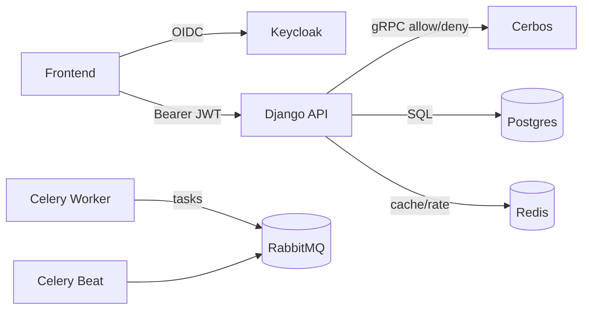
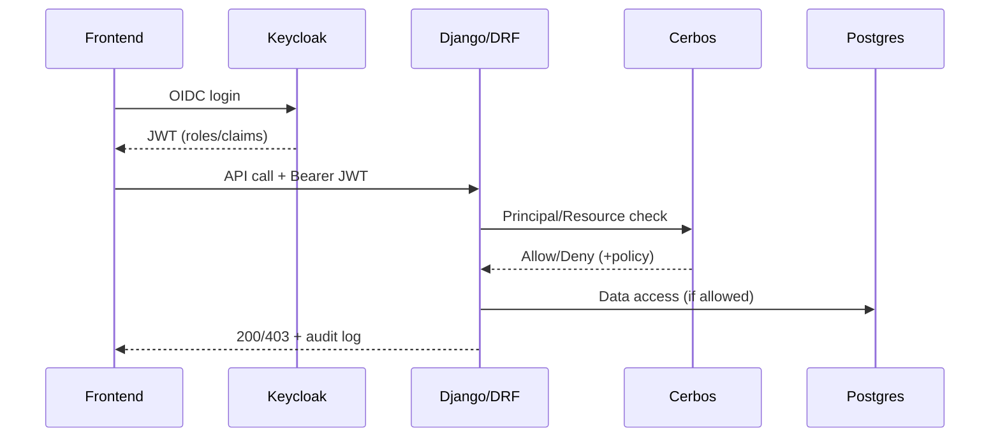

# Django + DRF + Keycloak + Cerbos Boilerplate (High-Scale RBAC/ABAC)

This repo is an API-first, multi-tenant starter tuned for high-scale RBAC + ABAC with Keycloak (IdP) and Cerbos (PDP). It includes process-per-concern containers, RabbitMQ-backed Celery, Redis caches/rate limits, optional Stripe licensing sync, and S3-compatible storage.

## Table of Contents

- [Service Topology](#service-topology)
- [Quickstart](#quickstart)
- [Environment Variables](#environment-variables)
- [API Endpoints](#api-endpoints)
- [Authentication & Authorization](#authentication--authorization)
- [Storage Configuration](#storage-configuration)
- [Runbooks](#runbooks)
- [Architecture Overview](#architecture-overview)
- [Testing](#testing)
- [Extending with Modules](#extending-with-modules)

## Service Topology

Development stack via Docker Compose:

| Service | Description | Port |
|---------|-------------|------|
| web | Django/DRF API (stateless) | 8000 |
| celery | Celery workers (same image, worker entrypoint) | - |
| celery-beat | Celery scheduler (same image, beat entrypoint) | - |
| cerbos | Policy Decision Point for RBAC/ABAC | 3592, 3593 |
| keycloak | Identity Provider (realms/clients seeded) | 8080 |
| postgres | Primary database | 5432 |
| rabbitmq | Celery broker (durable queues + DLQ) | 5672, 15672 |
| redis | Cache, rate limits, locks | 6379 |
| minio | S3-compatible storage (optional) | 9000, 9001 |
| stripe-mock | Stripe API mock for testing (optional) | 12111 |



## Quickstart

### Prerequisites

- Python 3.13+
- Docker and Docker Compose
- `uv` (recommended) or `pip`

### 1. Clone and Setup

```bash
# Clone the repository
git clone <repo-url>
cd django-boilerplate

# Create virtual environment and install dependencies
python -m venv .venv
source .venv/bin/activate
pip install -r requirements.txt -r requirements-dev.txt
```

### 2. Configure Environment

```bash
# Copy example environment file
cp .env.example .env

# Edit .env with your values (defaults work for local dev)
```

### 3. Start Services

```bash
# Start all services
docker compose -f compose/docker-compose.yml up -d

# Wait for services to be healthy (especially Keycloak ~30s)
docker compose -f compose/docker-compose.yml ps

# Run database migrations
docker compose -f compose/docker-compose.yml exec -w /app/backend web python manage.py migrate
```

### 4. Verify Setup

```bash
# Health check
curl http://localhost:8000/healthz
# Expected: {"status": "ok"}

# Readiness check (verifies DB, cache, Cerbos)
curl http://localhost:8000/api/v1/health/ready
# Expected: {"status": "ready", "checks": {...}}

# Liveness check
curl http://localhost:8000/api/v1/health/live
# Expected: {"status": "alive"}
```

### 5. Get a Token from Keycloak

```bash
# Get access token for platform_admin user
TOKEN=$(curl -s -X POST "http://localhost:8080/realms/app/protocol/openid-connect/token" \
  -H "Content-Type: application/x-www-form-urlencoded" \
  -d "grant_type=password" \
  -d "client_id=api" \
  -d "username=platform_admin" \
  -d "password=password" | jq -r '.access_token')

echo $TOKEN
```

### 6. Make Authenticated API Calls

```bash
# Ping endpoint (requires valid JWT)
curl -H "Authorization: Bearer $TOKEN" http://localhost:8000/api/v1/ping
# Expected: {"message": "pong", "user": "..."}

# Celery health
curl http://localhost:8000/api/v1/monitoring/celery/health
# Expected: {"status": "healthy", "workers": [...]}

# Queue stats
curl http://localhost:8000/api/v1/monitoring/queues
# Expected: {"queues": [...], "active_queues": [...]}

# Prometheus metrics
curl http://localhost:8000/api/v1/monitoring/metrics
```

## Environment Variables

### Core Django Settings

| Variable | Description | Default |
|----------|-------------|---------|
| `DJANGO_SECRET_KEY` | Django secret key (change in production!) | `changeme` |
| `DJANGO_DEBUG` | Enable debug mode | `true` |
| `DJANGO_ALLOWED_HOSTS` | Comma-separated allowed hosts | `localhost,127.0.0.1` |
| `DJANGO_SETTINGS_MODULE` | Settings module to use | `config.settings.local` |

### Database (PostgreSQL)

| Variable | Description | Default |
|----------|-------------|---------|
| `POSTGRES_DB` | Database name | `app` |
| `POSTGRES_USER` | Database user | `app` |
| `POSTGRES_PASSWORD` | Database password | `changeme` |
| `POSTGRES_HOST` | Database host | `postgres` |
| `POSTGRES_PORT` | Database port | `5432` |

### Redis

| Variable | Description | Default |
|----------|-------------|---------|
| `REDIS_HOST` | Redis host | `redis` |
| `REDIS_PORT` | Redis port | `6379` |
| `REDIS_DB_CACHE` | Redis DB for cache | `0` |
| `REDIS_DB_RATELIMIT` | Redis DB for rate limiting | `1` |

### RabbitMQ

| Variable | Description | Default |
|----------|-------------|---------|
| `RABBITMQ_HOST` | RabbitMQ host | `rabbitmq` |
| `RABBITMQ_PORT` | RabbitMQ port | `5672` |
| `RABBITMQ_USER` | RabbitMQ user | `guest` |
| `RABBITMQ_PASSWORD` | RabbitMQ password | `guest` |

### Keycloak (Authentication)

| Variable | Description | Default |
|----------|-------------|---------|
| `KEYCLOAK_SERVER_URL` | Keycloak server URL | `http://keycloak:8080` |
| `KEYCLOAK_REALM` | Keycloak realm | `app` |
| `KEYCLOAK_CLIENT_ID` | Keycloak client ID | `api` |
| `KEYCLOAK_AUDIENCE` | Expected JWT audience | `api` |

### Cerbos (Authorization)

| Variable | Description | Default |
|----------|-------------|---------|
| `CERBOS_URL` | Cerbos server URL | `http://cerbos:3592` |
| `CERBOS_DECISION_CACHE_TTL` | Decision cache TTL (seconds) | `30` |

### Security

| Variable | Description | Default |
|----------|-------------|---------|
| `ADMIN_HOSTNAME` | Hostname for Django admin (production) | `` |
| `AXES_FAILURE_LIMIT` | Login failures before lockout | `5` |
| `AXES_COOLOFF_TIME` | Lockout duration (hours) | `1` |
| `THROTTLE_RATE_ANON` | Anonymous rate limit | `100/hour` |
| `THROTTLE_RATE_USER` | Authenticated rate limit | `1000/hour` |
| `CORS_ALLOWED_ORIGINS` | Allowed CORS origins | `http://localhost:3000` |

### Observability

| Variable | Description | Default |
|----------|-------------|---------|
| `LOG_LEVEL` | Logging level | `INFO` |
| `ENVIRONMENT` | Environment name | `development` |
| `AUDIT_PII_POLICY` | PII handling: mask, hash, drop | `mask` |
| `SENTRY_DSN` | Sentry DSN (leave empty to disable) | `` |
| `SENTRY_ENVIRONMENT` | Sentry environment | `development` |
| `SENTRY_TRACES_SAMPLE_RATE` | Sentry trace sampling rate | `0.0` |

### Storage (S3/MinIO)

| Variable | Description | Default |
|----------|-------------|---------|
| `USE_S3` | Enable S3 storage | `false` |
| `AWS_ACCESS_KEY_ID` | S3 access key | `minio` |
| `AWS_SECRET_ACCESS_KEY` | S3 secret key | `minio123` |
| `AWS_STORAGE_BUCKET_NAME` | S3 bucket name | `app-bucket` |
| `AWS_S3_ENDPOINT_URL` | S3 endpoint (for MinIO) | `http://minio:9000` |

### Stripe (Optional)

| Variable | Description | Default |
|----------|-------------|---------|
| `STRIPE_ENABLED` | Enable Stripe integration | `false` |
| `STRIPE_SECRET_KEY` | Stripe secret key | `` |
| `STRIPE_WEBHOOK_SECRET` | Stripe webhook secret | `` |

## API Endpoints

### Health & Monitoring

| Endpoint | Method | Auth | Description |
|----------|--------|------|-------------|
| `/healthz` | GET | No | Basic health check |
| `/api/v1/health/live` | GET | No | Kubernetes liveness probe |
| `/api/v1/health/ready` | GET | No | Kubernetes readiness probe |
| `/api/v1/monitoring/metrics` | GET | No | Prometheus metrics |
| `/api/v1/monitoring/metrics/json` | GET | No | JSON metrics |
| `/api/v1/monitoring/celery/health` | GET | No | Celery worker health |
| `/api/v1/monitoring/celery/stats` | GET | No | Celery statistics |
| `/api/v1/monitoring/queues` | GET | No | RabbitMQ queue stats |
| `/api/v1/monitoring/tasks` | GET | No | Registered Celery tasks |

### Authentication

| Endpoint | Method | Auth | Description |
|----------|--------|------|-------------|
| `/api/v1/ping` | GET | JWT | Auth verification endpoint |

### Licensing

| Endpoint | Method | Auth | Description |
|----------|--------|------|-------------|
| `/api/v1/orgs/<org_id>/license` | GET | JWT (org_admin) | Get org license |
| `/api/v1/orgs/<org_id>/license` | PUT | JWT (org_admin) | Update org license |
| `/api/v1/stripe/webhook` | POST | Stripe Signature | Stripe webhook handler |

### Admin

| Endpoint | Method | Auth | Description |
|----------|--------|------|-------------|
| `/api/v1/admin/orgs` | GET | JWT (platform_admin) | List all organizations |
| `/admin/` | GET | Session | Django admin (hostname-restricted in production) |

## Authentication & Authorization

### JWT Token Structure

Tokens issued by Keycloak include:
- `sub`: User ID (mapped to Django User)
- `iss`: Issuer (Keycloak realm URL)
- `aud`: Audience (must match `KEYCLOAK_AUDIENCE`)
- `realm_access.roles`: Realm-level roles (e.g., `platform_admin`)
- `resource_access.<client>.roles`: Client-level roles (e.g., `org_admin`)
- `org_id`: Organization ID (custom claim)
- `team_ids`: Team IDs (custom claim)

### Keycloak Clients/Audiences

| Client | Audience | Purpose |
|--------|----------|---------|
| `api` | `api` | Main API client |
| `global-admin` | `global-admin` | Global admin console |
| `org-admin` | `org-admin` | Organization admin console |
| `end-user` | `end-user` | End-user application |

### Default Test Users

| Username | Password | Roles |
|----------|----------|-------|
| `platform_admin` | `password` | `platform_admin` (realm) |
| `support` | `password` | `support_readonly` (realm) |

### Admin Hostname Separation

In production, set `ADMIN_HOSTNAME` to restrict Django admin access:

```bash
ADMIN_HOSTNAME=admin.example.com
```

The admin will only be accessible from that hostname.

## Storage Configuration

### Local Storage (Default)

Files are stored in the `media/` directory. No configuration needed.

### S3/MinIO Storage

1. Enable S3:
```bash
USE_S3=true
```

2. Configure credentials:
```bash
AWS_ACCESS_KEY_ID=your-access-key
AWS_SECRET_ACCESS_KEY=your-secret-key
AWS_STORAGE_BUCKET_NAME=your-bucket
AWS_S3_ENDPOINT_URL=https://s3.amazonaws.com  # or MinIO URL
```

### MinIO (Local S3)

MinIO is included in Docker Compose for local S3 testing:
- Console: http://localhost:9001
- API: http://localhost:9000
- Credentials: `minio` / `minio123`

## Runbooks

### Rotate Django Secret Key

```bash
# 1. Generate new secret key
python -c "from django.core.management.utils import get_random_secret_key; print(get_random_secret_key())"

# 2. Update DJANGO_SECRET_KEY in .env (or secret manager)

# 3. Restart web containers
docker compose -f compose/docker-compose.yml restart web celery celery-beat
```

### Clear Redis Caches

```bash
# Connect to Redis
docker compose -f compose/docker-compose.yml exec redis redis-cli

# Clear all caches
FLUSHALL

# Or clear specific DB
SELECT 0  # Cache DB
FLUSHDB
```

### Invalidate Cerbos Decision Cache

```bash
# The decision cache is in Redis. Clear it:
docker compose -f compose/docker-compose.yml exec redis redis-cli
KEYS cerbos:decision:*
DEL cerbos:decision:*  # Delete all decision cache keys

# Or from Django shell:
docker compose -f compose/docker-compose.yml exec -w /app/backend web python manage.py shell
>>> from api.cerbos_client import invalidate_decision_cache
>>> invalidate_decision_cache()
```

### Recreate Containers

```bash
# Stop and remove containers
docker compose -f compose/docker-compose.yml down

# Remove volumes (CAUTION: deletes data)
docker compose -f compose/docker-compose.yml down -v

# Rebuild and start fresh
docker compose -f compose/docker-compose.yml up --build -d
```

### Reset Keycloak Realm

```bash
# Keycloak realm is imported from keycloak/realm-app.json on first start
# To reset:
docker compose -f compose/docker-compose.yml stop keycloak
docker compose -f compose/docker-compose.yml rm keycloak
docker volume rm compose_keycloak_data  # If exists
docker compose -f compose/docker-compose.yml up -d keycloak
```

### View Celery Task Logs

```bash
# View worker logs
docker compose -f compose/docker-compose.yml logs -f celery

# View beat logs
docker compose -f compose/docker-compose.yml logs -f celery-beat

# Check RabbitMQ management UI
open http://localhost:15672  # guest/guest
```

### Debug Failed Tasks (DLQ)

```bash
# Check DLQ message count
curl http://localhost:8000/api/v1/monitoring/queues | jq '.queues[] | select(.name == "dlq")'

# View DLQ messages in RabbitMQ management
open http://localhost:15672/#/queues/%2F/dlq
```

### Run Database Migrations

```bash
# Show pending migrations
docker compose -f compose/docker-compose.yml exec -w /app/backend web python manage.py showmigrations

# Apply migrations
docker compose -f compose/docker-compose.yml exec -w /app/backend web python manage.py migrate
```

### Create Superuser

```bash
docker compose -f compose/docker-compose.yml exec -w /app/backend web python manage.py createsuperuser
```

## Architecture Overview

### Request/AuthZ Flow



### Key Files

| Path | Description |
|------|-------------|
| `backend/api/auth.py` | JWT authentication class |
| `backend/api/permissions.py` | Cerbos permission class |
| `backend/api/cerbos_client.py` | Cerbos client with caching |
| `backend/config/middleware.py` | Request ID, admin hostname middleware |
| `backend/config/logging.py` | Structured logging with PII redaction |
| `backend/config/observability.py` | Metrics and request context |
| `policies/sample_resource.yaml` | Sample Cerbos policy |
| `keycloak/realm-app.json` | Keycloak realm configuration |

### Policy Bundle

Cerbos policies are in `policies/`:
- `sample_resource.yaml`: Example resource policy
- `.cerbos.yaml`: Cerbos configuration

### Secrets Handling

**Development:**
- Use `.env` file (not committed)
- Copy from `.env.example`

**Production:**
- Use secret manager (AWS Secrets Manager, Vault, etc.)
- Set `DJANGO_SETTINGS_MODULE=config.settings.production`
- Never commit secrets

## Testing

```bash
# Activate virtual environment
source .venv/bin/activate

# Run linter
ruff check .

# Run tests
DJANGO_SETTINGS_MODULE=config.settings.test pytest backend/ -v

# Run tests with coverage
DJANGO_SETTINGS_MODULE=config.settings.test pytest backend/ --cov=backend --cov-report=term-missing

# Security scan
pip-audit -r requirements.txt
safety check -r requirements.txt
```

### Test Coverage

Current coverage: **77%+** (threshold: 75%)

## Extending with Modules

1. Create a new Django app:
```bash
cd backend
python manage.py startapp mymodule
```

2. Register in `INSTALLED_APPS`:
```python
INSTALLED_APPS = [
    ...
    "mymodule",
]
```

3. Add URLs under `/api/v1/`:
```python
# src/config/urls.py
urlpatterns = [
    ...
    path("api/v1/mymodule/", include("mymodule.urls")),
]
```

4. Create Cerbos policies:
```yaml
# policies/mymodule_resource.yaml
apiVersion: api.cerbos.dev/v1
resourcePolicy:
  version: default
  resource: mymodule_resource
  rules:
    - actions: ["read"]
      effect: EFFECT_ALLOW
      roles: ["org_admin"]
      condition:
        match:
          expr: request.resource.attr.org_id == request.principal.attr.org_id
```

5. Use shared auth/authz:
```python
from api.permissions import CerbosPermission

class MyView(APIView):
    permission_classes = [CerbosPermission]
    resource_kind = "mymodule_resource"
```

## License

See LICENSE file.

## Related Documentation

- [PRD.md](PRD.md) - Full product requirements
- [MVP-TASKS.md](MVP-TASKS.md) - Implementation milestones
- [devtasks/](devtasks/) - Detailed task plans
- [Keycloak Admin](http://localhost:8080) - Keycloak console (admin/admin)
- [RabbitMQ Management](http://localhost:15672) - RabbitMQ console (guest/guest)
- [MinIO Console](http://localhost:9001) - MinIO console (minio/minio123)
